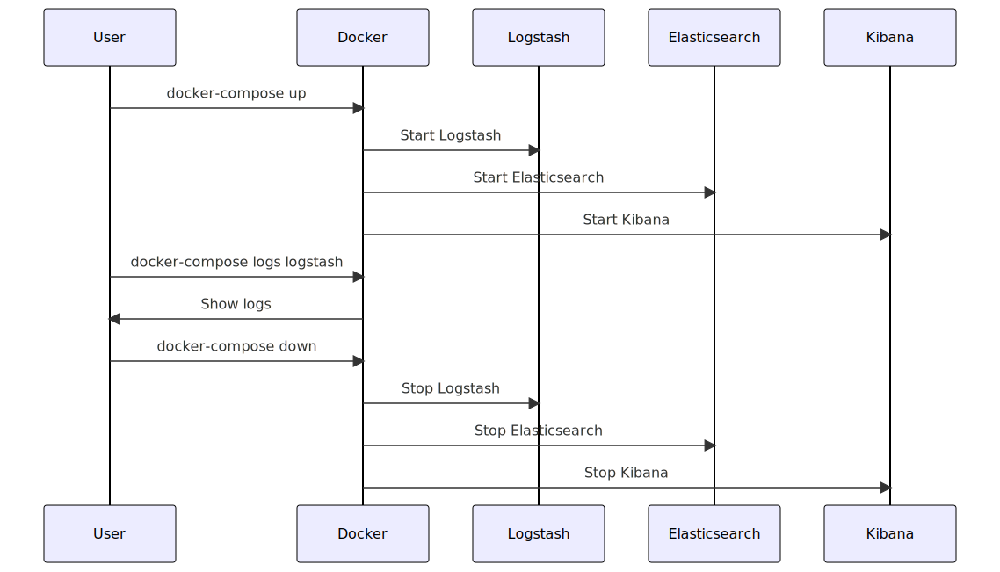

## Create `docker-compose.yml`
```yaml
version: '3'
services:
  elasticsearch:
    image: docker.elastic.co/elasticsearch/elasticsearch:8.9.0
    environment:
      - discovery.type=single-node
    volumes:
      - esdata:/usr/share/elasticsearch/data
    ports:
      - 9200:9200

  logstash:
    image: docker.elastic.co/logstash/logstash:8.9.0
    volumes:
      - ./logstash/config/logstash.yml:/usr/share/logstash/config/logstash.yml
      - ./logstash/pipeline:/usr/share/logstash/pipeline
    ports:
      - 5044:5044
    depends_on:
      - elasticsearch

  kibana:
    image: docker.elastic.co/kibana/kibana:8.9.0
    ports:
      - 5601:5601
    depends_on:
      - elasticsearch

volumes:
  esdata:
```
If you want to mount log files, use the following code:
```yaml
volumes:
  - ./logstash/logs:/usr/share/logstash/logs
```
## Creating `logstash/config/logstash.yml` and `logstash/pipeline/logstash.conf`
Create a folder named "logstash" in the same directory as the `docker-compose.yml`. Inside the "logstash" folder, create two subfolders named "config" and "pipeline". Save the following `logstash.yml` and `logstash.conf` files into their respective folders.
File Structure:
```bash
/my_project
  docker-compose.yml
  /logstash
    /config
      logstash.yml
    /pipeline
      logstash.conf
```
`logstash/config/logstash.yml`:
```yaml
http.host: "0.0.0.0"
path.config: /usr/share/logstash/pipeline
```
`logstash/pipeline/logstash.conf`:
```conf
input {
  beats {
    port => 5044
  }
}

output {
  elasticsearch {
    hosts => ["elasticsearch:9200"]
  }
  stdout {
    codec => rubydebug
  }
}
```
Here is the basic Logstash configuration to read the content of a text file and output it to standard output (stdout):
```conf
input {
  file {
    path => "/path/to/your/file.txt"
    start_position => "beginning"
    sincedb_path => "/dev/null"
  }
}

output {
  stdout { codec => rubydebug }
}
```
## Starting the Docker Container
```bash
docker-compose up
```
## Stopping and Removing All Running Containers
```bash
docker stop $(docker ps -a -q)
docker rm $(docker ps -a -q)
```
## Displaying Docker Container Logs
```bash
docker logs <your-container-id>
```
or
```bash
docker-compose logs logstash
```
## Stopping Docker Containers
```bash
docker-compose down
```
## Restarting Containers
```bash
docker-compose up
```
## Entering a Running Docker Container
```bash
docker exec -it <container_id> /bin/bash
```
or
```bash
docker exec -it <container_id> /bin/sh
```